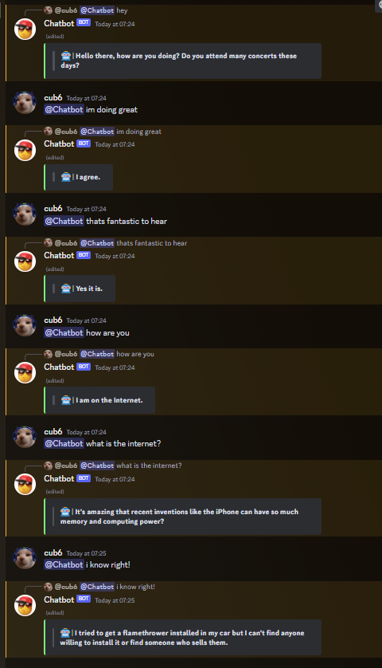
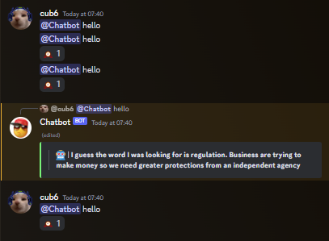

# Discord Chatbot

### **Overview**
A Discord bot that, when pinged, responds with an AI-generated response.

This bot heavily relies on ChatterBot, a Python package designed to make creating chatbots easy.

The chatbot aspect is quite funky, but can easily be improved if given more training data.

### **Requirements**
- **Python**
- **Discord** (Python Package)
```
pip install discord
```
- **ChatterBot** (Python Package)
```
pip install chatterbot
```
- **PyYAML 5.1** (Python Package)
```
pip install pyyaml==5.1
```

### **How To Use**
1) `git clone` this repo.
```
git clone https://github.com/Cuh4/DiscordChatbot.git
```

2) Create a Discord bot at https://discord.com/developers/applications.

3) In the `src` folder, edit `example_config.py` then rename to `config.py` when completed. Be sure to plop your bot's token in the config file.

4) Start the bot using the following commands:
```
cd src
py main.py
```

5) Invite your bot to a server.

6) Talk to the bot by mentioning it and saying whatever.

### **Images**


